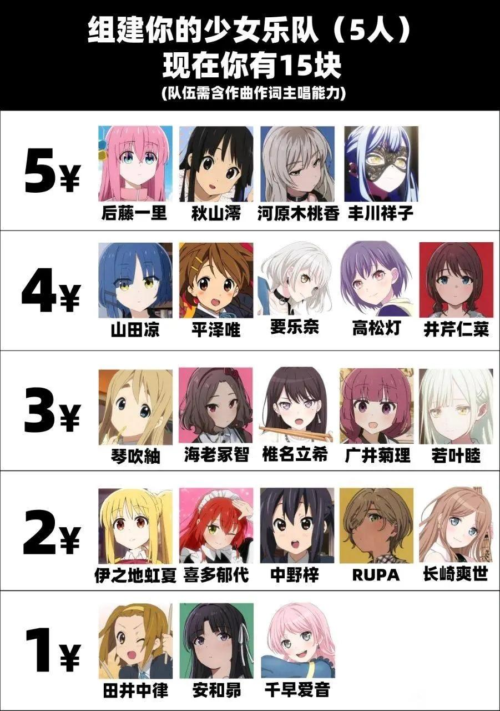

# band-together 一起组乐队吧！

~~组一辈子的乐队（bus）~~

以网上流传的梗图 “15元组乐队” 为原型做的前端可动版，做着玩的）

## 功能

- **乐队成员选择**：用户可以通过拖动（PC）或点击（移动端）选择乐队成员。
- **组合结果展示**：在PC界面，选择的组合结果将显示在右侧；在移动端，组合结果默认收起，点击右下角按钮可展开查看。
- **金额计算**：根据选择的乐队成员自动计算总开销，并在预览中显示。
- **二维码生成**：生成分享二维码，方便用户分享组合结果。
- **响应式设计**：支持PC和移动端，确保良好的用户体验。

## TODO

* [ ] 优化前端设计
* [ ] 根据乐队成员标签进行高级筛选
* [ ] 添加更多 [乐队成员](assets/data/member.json)

## Finished

* [x] ~~基本能用了x~~
* [x] 前端版式设计
* [x] 添加乐队成员
* [x] 乐队成员分类展示
* [x] 设计选择乐队成员交互（PC拖动，PE点击）
* [x] 保存选择内容为图片
* [x] 生成分享二维码
* [x] 添加金额计算